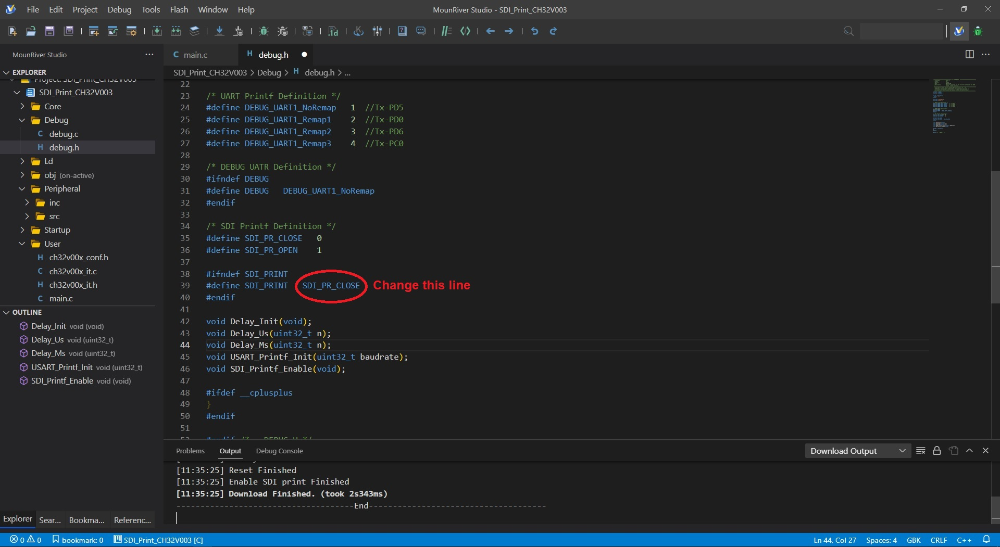
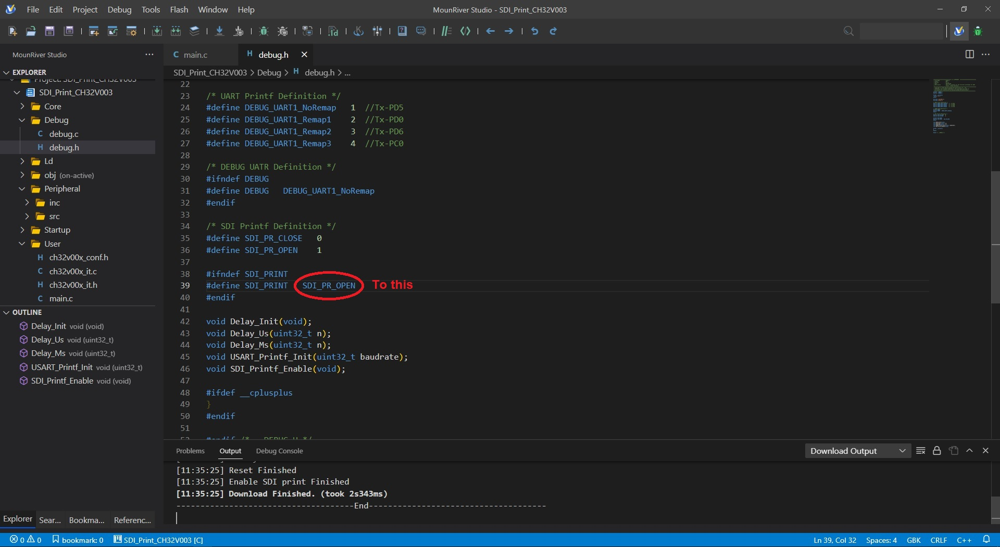
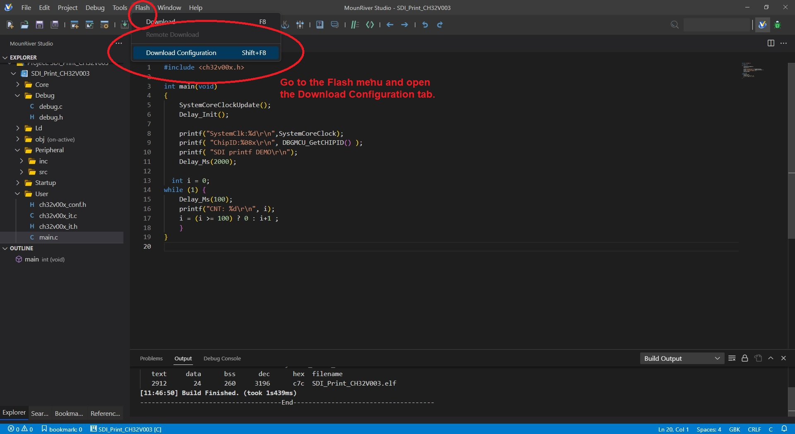
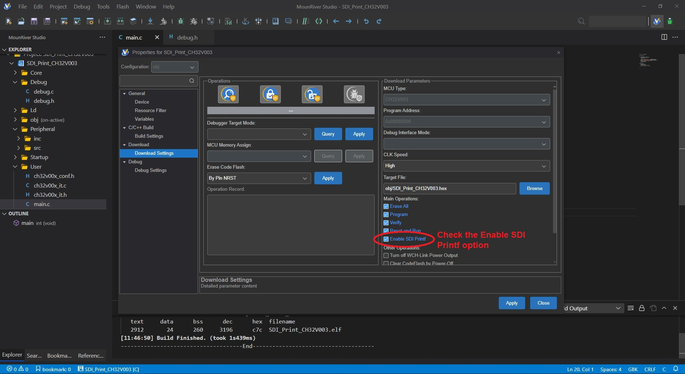
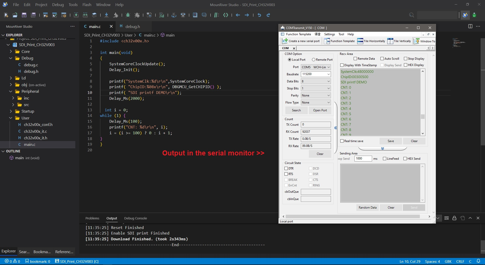
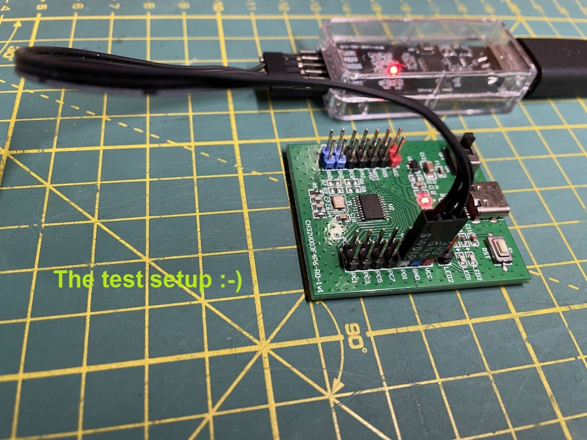

# How to do SDI Printf in MounRiver Studio 2
CH32V003_SDI_Printf_in_MRS2

In debug.h the SDI_PR_CLOSE 

Change to SDI_PR_OPEN

Then go to the Flash menu and open the Download Configuration tab

Check the Enable SDI Printf option

Open the serial monitor console and check the data stream

The HW test setup

